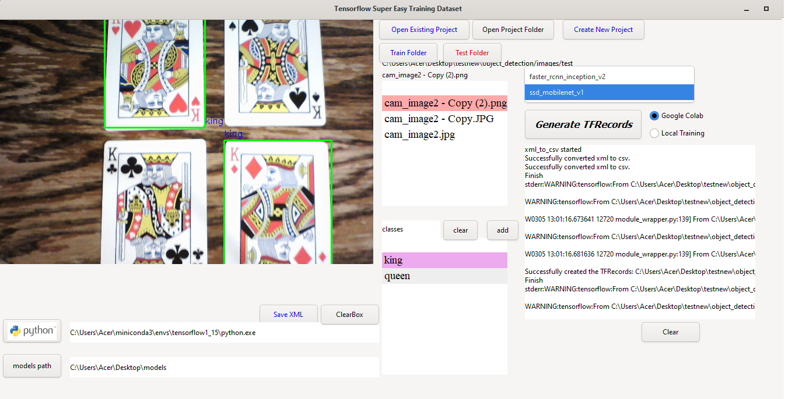

# TensorflowTrainingAppQT

No need for labelimage(already builtin) 

No Terminal command needed while creating TFRecords

SSD or fasterRCNN

Local training or Google Colab training of dataset

Click and execute in Colab ipynb(no need to type every commands)

Requirements

PyQT5
cv2
pandas
Tensorflow==2.0

or download python37 with all requirements already installed from this google drive link

https://drive.google.com/file/d/1-QKWjbWvoe6L4I3DzGOqu-0Z-jjApl0V/view?usp=sharing

WiredQQTv1.0

https://github.com/chiptrontech/WiredQTv1.0

